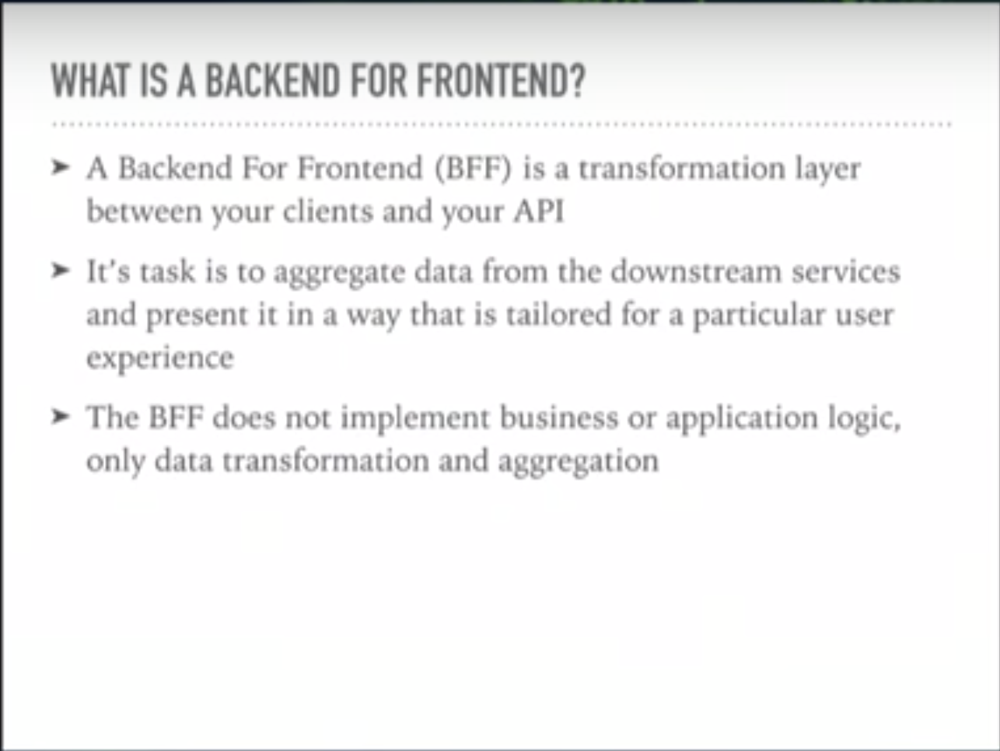
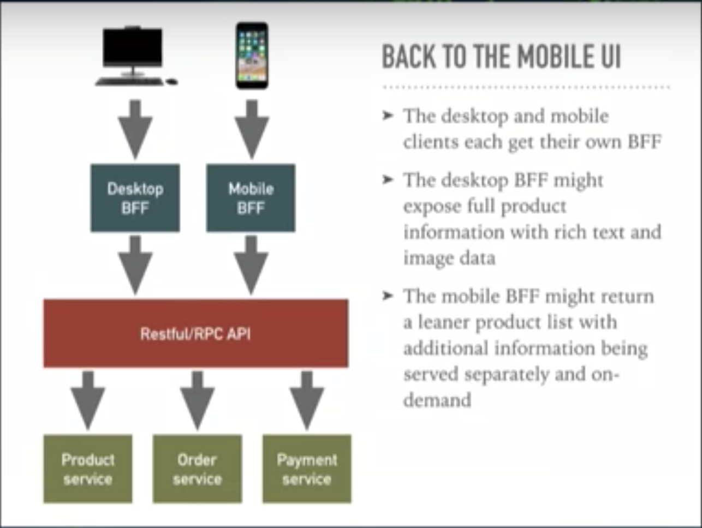
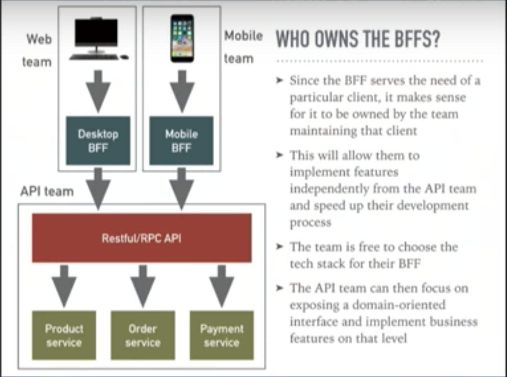
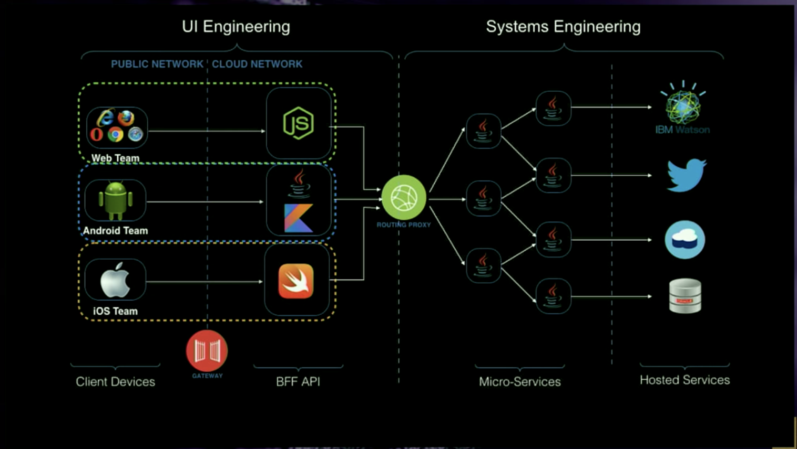
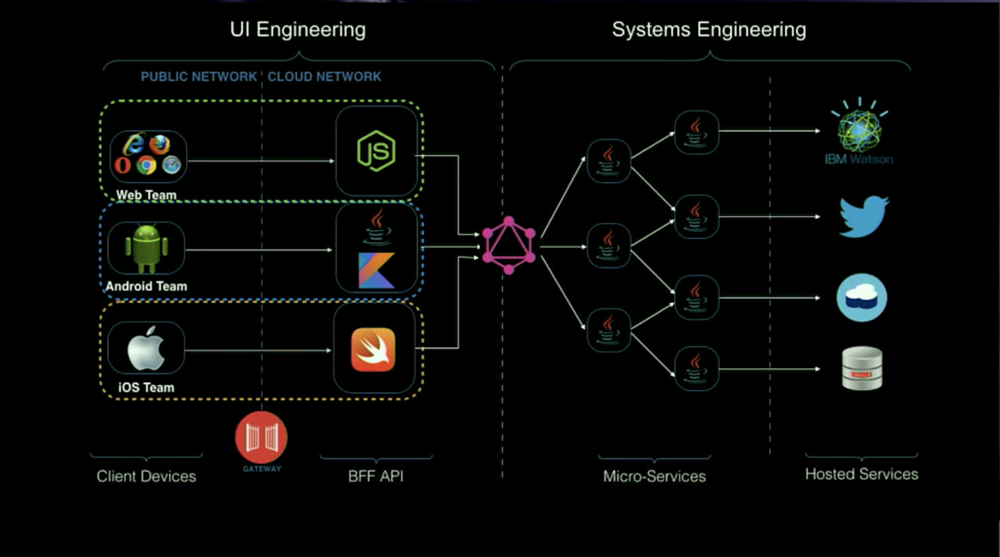
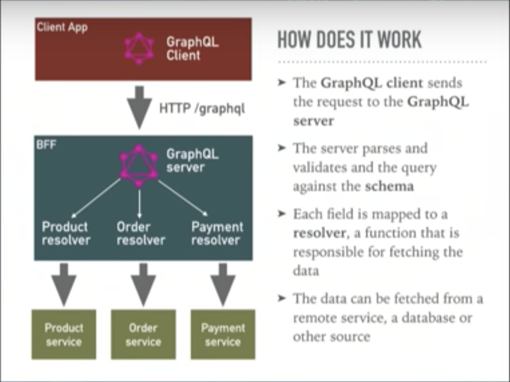
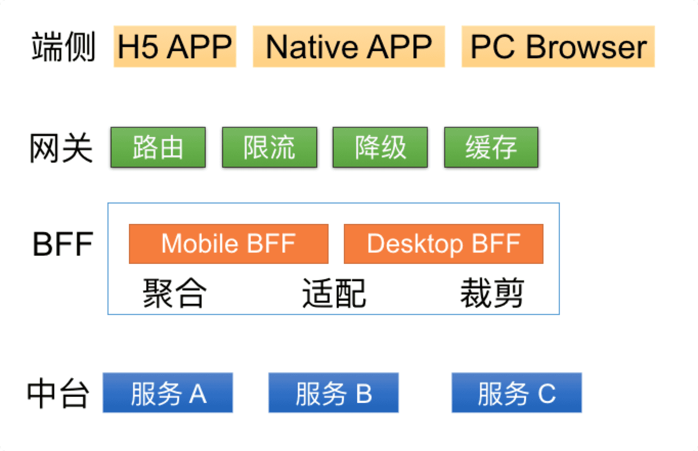

- BFF 是在客户端与后台服务api之间的转换层
- BFF 从下游服务获取数据并根据用户界面或用户体验裁剪数据提供给前端界面
- BFF 不实现业务应用逻辑，只是转换整合数据

- 不同的客户端可以拥有自己的BFF
- 如桌面客户端BFF可能返回完全丰富的产品信息如详细描述、图片
- 如移动客户端BFF可能只返回简单的产品信息列表

- 前端团队拥有并负责开发BFF，可以采用同一样的技术栈如小程序前端采用H5、javascript，BFF采用nodejs
- 前端团队专注用户界面与用户体验而无需等待业务逻辑实现团队提供的api
- 这样减少与业务逻辑实现团队沟通，在还没有业务逻辑api之前，前端团队自己可以在BFF完全MOCK数据来支持用户界面或用户体验的开发

- 前端团队拥有并负责开发BFF，可以采用同一样的技术栈如小程序前端采用H5、javascript，BFF采用nodejs
- 前端团队专注用户界面与用户体验而无需等待业务逻辑实现团队提供的api
- 这样减少与业务逻辑实现团队沟通，在还没有业务逻辑api之前，前端团队自己可以在BFF完全MOCK数据来支持用户界面或用户体验的开发

- 前端团队拥有并负责开发BFF，可以采用同一样的技术栈如小程序前端采用H5、javascript，BFF采用nodejs
- 前端团队专注用户界面与用户体验而无需等待业务逻辑实现团队提供的api
- 这样减少与业务逻辑实现团队沟通，在还没有业务逻辑api之前，前端团队自己可以在BFF完全MOCK数据来支持用户界面或用户体验的开发

# BFF Backend For Front, 
## 主要作为：
1. 为客户端用户界面提供整合、裁剪后的业务数据，特别根据用户界面进行适配的
1. 也有可能保存客户端应用的用户设置数据，如设置为暗黑皮肤
## 代码组织
1. FFU Frontend for User 客户端应用用户界面代码    Doper-FFU
1. BFF Backend for Frontend 客户端应用后台为前台代码   Doper-BFF
1. 代码仓库组织如下：   
    - 1.  Doper
        - 1.1. Doper-FFU
        - 1.2. Doper-BBF
        - 1.3. README.md

使用 GraphQL 搭建 BFF，如果出现前后端分工、沟通等方面的矛盾。我们可以将 GraphQL 服务降级为 RESTful 服务，无非就是把需要前端编写的查询语句，写死在后端接口里面罢了。

如果实现的是 RESTful 服务，要转换成 GraphQL 服务，就没有那么简单了。

有了这种优雅降级的能力，我们可以更加放心大胆的推动 GraphQL-BFF 方案。

两类 GraphQL API Gateway 服务
同样是 API Gateway 角色的 GraphQL 服务，在实现方式上也有不同的分类。

1）包含大量真实的数据操作和处理的 GraphQL

2）转发数据请求，聚合数据结果的 GraphQL

第一类，是传统意义上的后端服务；第二类，[则是我们今天的重点，GraphQL as BFF。](https://www.infoq.cn/article/8CTAakhd*EsUtwqIcGNl)

# 基于函数计算的 BFF 架构

[基于函数计算的 BFF 架构](https://yq.aliyun.com/articles/752780)
函数计算平台的 BFF 架构方案有四层：端侧、网关层、BFF 层和中台服务。

端侧可以保持自己熟悉的技术方案进行开发。比如网页端可以选择 React 或者 Vue.js，移动端可以选择 Java/Kotlin 或者 Objective C/Swift。也可以选择 React Native 或者 Flutter 这种跨多端的方案。

网关层有两种选择：API Gateway 和 HTTP Trigger。API Gateway 的功能丰富，支持限流，但是会产生额外的费用。HTTP Trigger 支持简单的路由映射，绑定域名，虽然不支持限流但是免费的，适用于轻量级应用。

本地调试。偏好命令行的开发者可以使用 [funcraft](https://github.com/alibaba/funcraft) 工具通过 fun local start 本地启动服务。偏好桌面 GUI 的开发者可以使用函数计算提供的 [VSCode Plugin](https://marketplace.visualstudio.com/items?itemName=aliyun.aliyun-serverless)。

单元测试可以选中自己喜欢的测试框架：Mocha 或者 Jest
