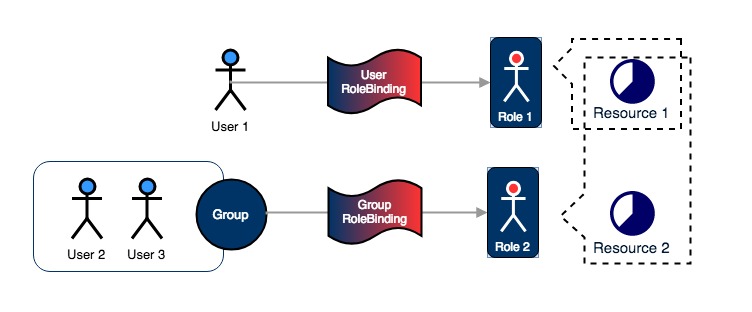
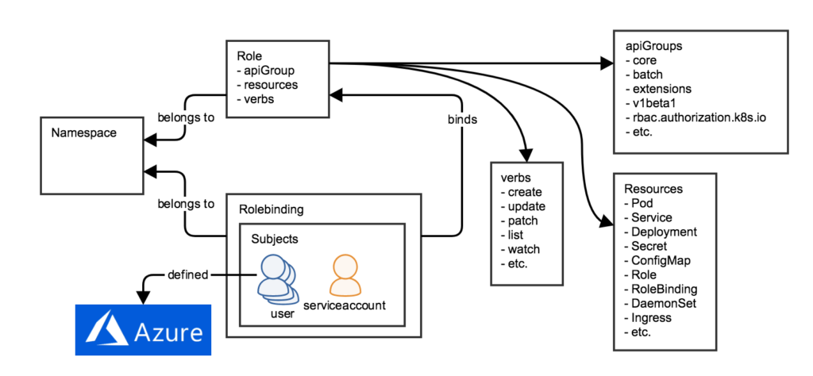
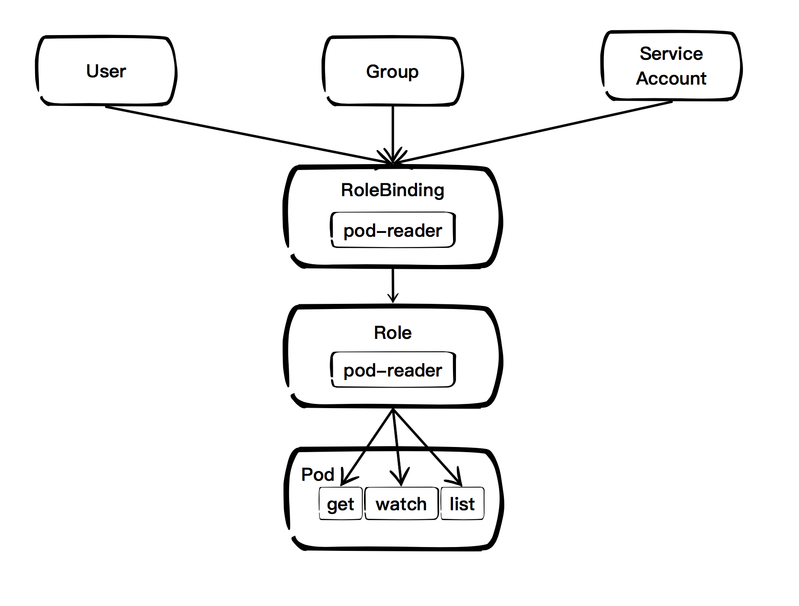
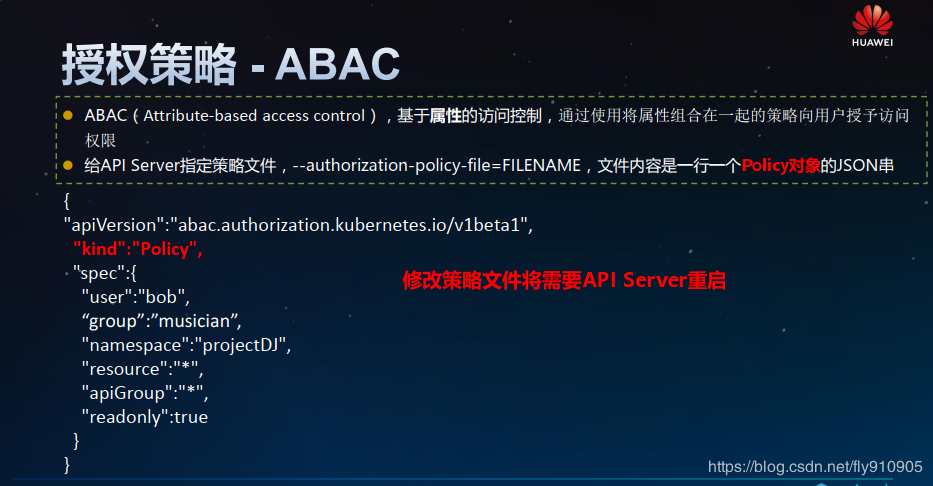
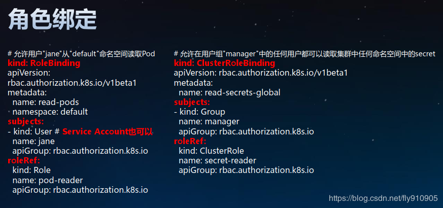

# Dgraph ACL Requirement
1. *全平台将有一个超级用户root可以存取平台内所有访问控制规则而不能存取任何数据
1. *全平台的超级用户root可以创建平台用户组，添加用户到用户组
1. *创建组织内或个人的用户组，添加用户到用户组
1. *每一个用户可以属于多个用户组
1. *资源实体如Product、Organization、Order在系统设计时已指定Action进行访问
1. *访问控制可以分配给用户组，也可分配给指定单独个人，也就是用户组或个人可以执行限定的Action
1. *每个组织或个人拥有自己局部的超级用户goot可以存取所拥有的数据及做所有操作
1. *每个组织或个人可以分派自己所有访问控制权限给自己用户组或个人
1. 记录所有访问，包括在哪些资源上进行的操作尝试，不管成功或失败都要记录
1. root 隶属于【全平台】一个特别的监管组 【guardians】. 监管组【guardians】可以访问所有访问规则，根据需要添加更多用户.
1. goot 隶属于【组织或个人】一个特别的监管组 【guardians】. 监管组【guardians】可以访问所有数据及访问规则，根据需要添加更多用户.
1. 资源的每个属性将有两类访问权限：READ能够查询该属性值、WRITE能够变更该属性值
- [The requirements: We started the project by asking what are the features that we must support for access control to work both securely and seamlessly for our customers. After a few rounds of brainstorming and feedback, we settled on the following list:](https://blog.dgraph.io/post/access-control-in-dgraph/)

# Kubernetes的核心技术概念和API对象
## API对象是K8s集群中的管理操作单元。
K8s集群系统每支持一项新功能，引入一项新技术，一定会新引入对应的API对象，支持对该功能的管理操作。例如副本集Replica Set对应的API对象是RS。

每个API对象都有3大类属性：元数据metadata、规范spec和状态status。元数据是用来标识API对象的，每个对象都至少有3个元数据：namespace，name和uid；除此以外还有各种各样的标签labels用来标识和匹配不同的对象，例如用户可以用标签env来标识区分不同的服务部署环境，分别用env=dev、env=testing、env=production来标识开发、测试、生产的不同服务。规范描述了用户期望K8s集群中的分布式系统达到的理想状态（Desired State），例如用户可以通过复制控制器Replication Controller设置期望的Pod副本数为3；status描述了系统实际当前达到的状态（Status），例如系统当前实际的Pod副本数为2；那么复制控制器当前的程序逻辑就是自动启动新的Pod，争取达到副本数为3。

K8s中所有的配置都是通过API对象的spec去设置的，也就是用户通过配置系统的理想状态来改变系统，这是k8s重要设计理念之一，即所有的操作都是声明式（Declarative）的而不是命令式（Imperative）的。声明式操作在分布式系统中的好处是稳定，不怕丢操作或运行多次，例如设置副本数为3的操作运行多次也还是一个结果，而给副本数加1的操作就不是声明式的，运行多次结果就错了。

## 用户帐户（User Account）和服务帐户（Service Account）
顾名思义，用户帐户为人提供账户标识，而服务账户为计算机进程和K8s集群中运行的Pod提供账户标识。用户帐户和服务帐户的一个区别是作用范围；用户帐户对应的是人的身份，人的身份与服务的namespace无关，所以用户账户是跨namespace的；而服务帐户对应的是一个运行中程序的身份，与特定namespace是相关的。

## 名字空间（Namespace）
名字空间为K8s集群提供虚拟的隔离作用，K8s集群初始有两个名字空间，分别是默认名字空间default和系统名字空间kube-system，除此以外，管理员可以可以创建新的名字空间满足需要。

## RBAC访问授权
K8s在1.3版本中发布了alpha版的基于角色的访问控制（Role-based Access Control，RBAC）的授权模式。相对于基于属性的访问控制（Attribute-based Access Control，ABAC），RBAC主要是引入了角色（Role）和角色绑定（RoleBinding）的抽象概念。在ABAC中，K8s集群中的访问策略只能跟用户直接关联；而在RBAC中，访问策略可以跟某个角色关联，具体的用户在跟一个或多个角色相关联。显然，RBAC像其他新功能一样，每次引入新功能，都会引入新的API对象，从而引入新的概念抽象，而这一新的概念抽象一定会使集群服务管理和使用更容易扩展和重用。

# Reference：

Kubernetes RBAC
为了让我们的新用户 "theone" 具有 Kubernetes 资源的访问权限，需要在 Kubernetes 中为其授权。RBAC 是将 Kubernetes resources 和 Kube API 的访问权限赋予一些“角色”（Role），然后通过 "User RoleBinding" 给单个用户赋予某个角色，或通过 "Group RoleBinding" 给一组用户赋予某个角色。用户获取角色后，就能相应获取该角色所具有的权限。其原理如下图 5 所示。

图 5. Kubernetes Role Based Access Control（RBAC）

User、RoleBinding、Role 都是 Kubernetes 的 Object，Resource 是我们要访问的 Kubernetes 中的 Object 或 API。而 Group 则是 User 的一个属性，在用户访问 Kubernetes Server API 的时候，Group 属性会作为 "Request Attribute" 传入，并被作为授权的重要依据。

我们假设有一个叫 "manager" 的 Group，我们要给这个 Group 赋予集群管理员（cluster-admin）的角色，这是通过在 Kubernetes 中创建如下的 ClusterRolebinding 来实现的。注意，下面的命令必须是由另一个具有相应权限的用户执行。




# ACL实例
假如对 Kubernetes 有一定的了解的话，应该会知道在 Kubernetes 中还有 authn/authz，为什么还会引入 admission 这种机制？

1) authn/authz 是 Kubernetes 的认证鉴权，运行在 filter 中，只能获取 http 请求 header 以及证书，并不能获取请求的 body。所以 authn/authz 只能对客户端进行认证和鉴权，不可以对请求的对象进行任何操作，因为这里根本还获取不到对象。 
2) Admission 运行在 API Server 的增删改查 handler 中，可以自然地操作 API resource。
Admission Controller 具体的 admit 操作，可以通过这里修改资源对象，例如为 Pod 挂载一个默认的 Service Account 等。 
4) API Server internal object validation，校验某个资源对象数据和格式是否合法，例如：Service Name 的字符个数不能超过63等。 
5) Admission Controller validate，可以自定义任何的对象校验规则。 6)internal object 转化为 versioned object，并且持久化存储到 etcd。

***访问K8S集群的资源需要过三关：认证、鉴权、准入控制。***

普通用户若要安全访问集群API Server，往往需要证书、 token、用户名-密码； Pod访问，需要ServiceAccount

K8S安全控制框架主要由下面3个阶段进行控制，每一个阶段都支持插件方式，通过API Server配置来启用插件
- ① Authentication
- ② Authorization
- ③ Admission Control


## 认证authn Authentication 三种客户端身份认证
认证方式|	安全级别|	API Server配置|	Client配置|	访问示例
-----|----|----|----|-----
证书+私钥|	高|	--client-ca-file： CA根证书 --tls-cert-file： API Server证书文件 --tls-private-key-file： API Server私钥文件 |	--certificate-authority： CA根证书 --client-certificate：客户端证书文件 --client-key：客户端私钥文件	|kubectl --server=https:/192.168.61.100:6443 --certificate-authority=ca.pem --clientcertificate=client.crt --client-key=client.key get nodes 
Token|	中|	--token-auth-file：静态Token文件， csv格式：token,user,uid,“group1,group2,group3”|	Kubectl --token或者：Authorization: Bearer ${token}	|kubectl –server=https:/192.168.61.100:6443 --token=792c62a1b5f2b07b --insecure-skip-tlsverify=true cluster-info 或者：curl -k --header “Authorization: Bearer792c62a1b5f2b07b” https:/192.168.61.100:6443/api
用户名+密码|	低	|--basic_auth_file： basic认证文件，不建议在生产环境使用 格式：password,user,uid,"group1,group2,group3“|	Kubectl –username –password或者：Authorization:BasicBASE64ENCODED(USER:PASSWORD)|	kubectl --server=https:/192.168.61.100:6443 --username=admin --password=1234 --insecure-skiptls-verify=true cluster-info 或者：curl -k --header "Authorization:BasicYWRtaW46MTIzNA=="https:/192.168.61.100:6443/api


## 鉴权authz Authorization
用户通过认证后，对指定的资源是否有权限访问，还需要经过授权环节。授权主要是用于对集群资源的访问控制，通过检查请求包含的相关属性值，与相对应的访问策略相比较， API请求必须满足某些策略才能被处理

> Kubernetes授权仅处理以下的请求属性：
- ① user, group, extra
- ② API、请求方法（如get、 post、 update、 patch和delete）和请求路径（如/api）
- ③ 请求资源和子资源
- ④ Namespace
- ⑤ API Group

API Server支持多种授权策略，通过启动参数“--authorization_mode”设置，可以同时启用多种策略

授权策略 | 功能描述
-----|-------
AlwaysAllow	|接受所有请求，如果集群不需要授权流程，采用该策略
AlwaysDeny	|拒绝所有请求，一般用于测试
ABAC	|基于属性的访问控制，使用用户配置的授权规则去匹配用户的请求
RBAC	|基于角色的访问控制， RBAC 的授权策略可以利用 kubectl 或者 Kubernetes API 直接进行配置。 RBAC 可以授权给用户，让用户有权进行授权管理，这样就可以无需接触节点，直接进行授权管理
Webhook	|WebHook 是一种 HTTP 回调， API Server把鉴权请求发给WebHook服务器，由服务器对请求进行鉴权
Node|	对Node授权，配合NodeRestriction准入控制来限制kubelet仅可访问node、endpoint、 pod、 service以及secret、configmap、 PV和PVC等相关的资源

## 授权策略-ABAC
- ABAC（ Attribute-based access control），基于属性的访问控制， 通过使用将属性组合在一起的策略向用户授予访问权限
- 给API Server指定策略文件， --authorization-policy-file=FILENAME，文件内容是一行一个Policy对象的JSON串


**ABAC-示例**

例子|功能描述
---|----
Alice可以对所有资源做任何操作|	{"apiVersion": "abac.authorization.kubernetes.io/v1beta1", "kind": "Policy", "spec": {"user": "alice", "namespace": "*", "resource": "*", "apiGroup": "*"}}
Kubelet可以读取任何Pod	|{"apiVersion": "abac.authorization.kubernetes.io/v1beta1", "kind": "Policy", "spec": {"user":"kubelet", "namespace": "*", "resource": "pods", "readonly": true}}
Kubelet可以读写事件	|{"apiVersion": "abac.authorization.kubernetes.io/v1beta1", "kind": "Policy", "spec": {"user":"kubelet", "namespace": "*", "resource": "events"}}
Bob可以在命名空间projectCaribou中读取Pod|	{"apiVersion": "abac.authorization.kubernetes.io/v1beta1", "kind": "Policy", "spec": {"user":"bob", "namespace": "projectCaribou", "resource": "pods", "readonly": true}}
任何人都可以对所有非资源路径进行只读请求|	{"apiVersion": "abac.authorization.kubernetes.io/v1beta1", "kind": "Policy", "spec": {"group":"system:authenticated", "readonly": true, "nonResourcePath": "*"}}{"apiVersion": "abac.authorization.kubernetes.io/v1beta1", "kind": "Policy", "spec": {"group":"system:unauthenticated", "readonly": true, "nonResourcePath": "*"}}

**授权策略-RBAC**

RBAC（ Role-Based Access Control），允许通过Kubernetes API 动态配置策略。
RBAC被映射成四种K8S顶级资源对象：

- 角色(Role)： Role、 ClusterRole
    * 角色表示一组权限的规则，累积规则
    * Role适用带namespace的资源， ClusterRole适用集群资源或非资源API
    

- 建立用户与角色的映射/绑定关系： RoleBinding、 ClusterRoleBinding
    * RoleBinding和ClusterRoleBinding的区别在于是否是namespace的资源
    * 角色绑定包含了一组相关主体（即subject, 包括用户、用户组、或者Service Account）以及对被授予角色的引用
    

### 名词解释：Namespace
Namespace
Namespace是对一组资源和对象的抽象集合，比如可以用来将系统内部的对象划分为不同的项目组或用户组。常见的pods, services, replication controllers和deployments等都是属于某一个namespace的（默认是default），而node, persistentVolumes等则不属于任何namespace。

Namespace常用来隔离不同的用户，比如Kubernetes自带的服务一般运行在kube-system namespace中。

```
$ kubectl get namespaces
NAME          STATUS    AGE
default       Active    11d
kube-system   Active    11d
```
注意：namespace包含两种状态”Active”和”Terminating”。在namespace删除过程中，namespace状态被设置成”Terminating”。

 
# [Kubernetes资源与对象简述](https://www.cnblogs.com/life-of-coding/p/12156685.html)

## 资源和对象
  Kubernetes 中的所有内容都被抽象为“资源”，如 Pod、Service、Node 等都是资源。“对象”就是“资源”的实例，是持久化的实体。如某个具体的 Pod、某个具体的 Node。Kubernetes 使用这些实体去表示整个集群的状态。

ps: 本文不会刻意说 “对象” 这一词，对于某个具体的 Pod、Node，有时候可能也说成是 “资源”，这其实也是合理的，对象是资源的实例，所以对象也是资源，不必要钻牛角尖，理解意思即可。
## 对象规约（Spec）和状态（Status）
  对象是用来完成一些任务的，是持久的，是有目的性的，因此 kubernetes 创建一个对象后，将持续地工作以确保对象存在。
> 除 “spec” 字段外，在创建一个Pod及Pod的控制器对象时，还要像上面模板所示一样，还要有这三个字段:
“apiVersion”——“创建该对象所使用的 Kubernetes API 的版本”；
“kind”——“想要创建的对象的类型”；
“metadata”——“帮助识别对象唯一性的数据，包括一个 name 字符串、UID 和可选的 namespace。”

## 对象的常用属性
### name和uid
  k8s 中每个对象都有 uid ，uid 是 k8s 自动为对象生成的，可以唯一标识该对象的字符串。uid 是用于给 k8s 本身管理对象的标识，对人类来说其可读性太差，因此对象还具有另一个属性 —— 可读性相对更好的，有一定意义的 “名称” 。在创建对象时可以给对象指定名称。不属于同一类别的对象可以有相同的名称，而同一种类型的对象，想要赋予相同的名称，则需要用到 namespace。
### NameSpace
在 k8s 中， namespace (命名空间) 也称为虚拟集群。namespace 用来在逻辑上对资源进行分组(是的，namespace 用来给资源分组，namespace 本身也是资源...)。怎样个分组法？譬如，一个 k8s 集群上部署两个应用——一个是商城，叫 sMall；另一个是视频类应用，叫 iQipa。那么可以创建两个 namespace，然后给前者所有资源分配名为 “sMall” 的 namespace，后者分配 “iQipa”，这样，两个不同的项目各自管理自己的资源，互不干扰。
  可以用 “kubectl get” 命令罗列在集群中存在的某一类资源的对象，例如想要获取 “sMall” 的所有 pod，可以输入命令:

```
kubectl get pods --namespace=sMall
```

对应的，如果想要获取 iQipa 的 service，则输入命令

```
kubectl get services --namespace=iQipa
```

  k8s 集群搭建好后，会创建一个名为 "default" 的 namespace，当没有为资源明确指定 namespace 时，会默认分配该 namespace。kubernetes 的组件，分配的是名为 “kube-system” 的 namespace。
  命名空间为名称提供了一个范围。对象的名称需要在命名空间内是唯一的，但不能跨命名空间。命名空间不能相互嵌套，每个 Kubernetes 对象只能在一个命名空间中。大多数 kubernetes 资源的对象（例如 Pod、Service、副本控制器等）都位于某些命名空间中。但是命名空间资源本身并不在命名空间中。而且底层资源，例如 nodes 和持久化卷不属于任何命名空间。可以使用命令查看哪些资源在 namespace 中，哪些不在:

***列出在命名空间中的资源***
```
kubectl api-resources --namespaced=true
```

***列出不在命名空间中的资源***
```
kubectl api-resources --namespaced=false
```

### label和selector
  label （标签）是附加到 Kubernetes 对象（比如 Pods）上的键值对，用于区分对象（比如Pod、Service）。 label 旨在用于指定对用户有意义且相关的对象的标识属性，但不直接对核心系统有语义含义。 label 可以用于组织和选择对象的子集。label 可以在创建时附加到对象，随后可以随时添加和修改。可以像 namespace 一样，使用 label 来获取某类对象，但 label 可以与 selector 一起配合使用，用表达式对条件加以限制，实现更精确、更灵活的资源查找。
  label 与 selector 配合，可以实现对象的“关联”，“Pod 控制器” 与 Pod 是相关联的 —— “Pod 控制器”依赖于 Pod，可以给 Pod 设置 label，然后给“控制器”设置对应的 selector，这就实现了对象的关联。
  每个对象都可以定义一组键/值标签。每个键对于给定对象必须是唯一的。如：
```
"metadata": {
  "labels": {
    "app1" : "iQipa",
    "app2" : "sMall"
  }
}
```
