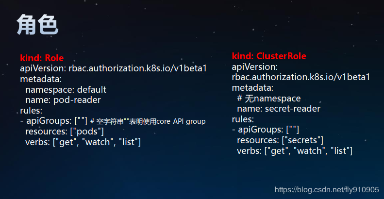

1. *全平台将有一个超级用户root可以存取平台内所有访问控制规则而不能存取任何数据
1. *全平台的超级用户root可以创建平台用户组，添加用户到用户组
1. *创建组织内或个人的用户组，添加用户到用户组
1. *每一个用户可以属于多个用户组
1. *资源实体如Product、Organization、Order在系统设计时已指定Action进行访问
1. *访问控制可以分配给用户组，也可分配给指定单独个人，也就是用户组或个人可以执行限定的Action
1. *每个组织或个人拥有自己局部的超级用户goot可以存取所拥有的数据及做所有操作
1. *每个组织或个人可以分派自己所有访问控制权限给自己用户组或个人
1. 记录所有访问，包括在哪些资源上进行的操作尝试，不管成功或失败都要记录
1. root 隶属于【全平台】一个特别的监管组 【guardians】. 监管组【guardians】可以访问所有访问规则，根据需要添加更多用户.
1. goot 隶属于【组织或个人】一个特别的监管组 【guardians】. 监管组【guardians】可以访问所有数据及访问规则，根据需要添加更多用户.
1. 资源的每个属性将有两类访问权限：READ能够查询该属性值、WRITE能够变更该属性值

Reference：
- [The requirements: We started the project by asking what are the features that we must support for access control to work both securely and seamlessly for our customers. After a few rounds of brainstorming and feedback, we settled on the following list:](https://blog.dgraph.io/post/access-control-in-dgraph/)

Kubernetes RBAC
为了让我们的新用户 "theone" 具有 Kubernetes 资源的访问权限，需要在 Kubernetes 中为其授权。RBAC 是将 Kubernetes resources 和 Kube API 的访问权限赋予一些“角色”（Role），然后通过 "User RoleBinding" 给单个用户赋予某个角色，或通过 "Group RoleBinding" 给一组用户赋予某个角色。用户获取角色后，就能相应获取该角色所具有的权限。其原理如下图 5 所示。

图 5. Kubernetes Role Based Access Control（RBAC）

User、RoleBinding、Role 都是 Kubernetes 的 Object，Resource 是我们要访问的 Kubernetes 中的 Object 或 API。而 Group 则是 User 的一个属性，在用户访问 Kubernetes Server API 的时候，Group 属性会作为 "Request Attribute" 传入，并被作为授权的重要依据。

我们假设有一个叫 "manager" 的 Group，我们要给这个 Group 赋予集群管理员（cluster-admin）的角色，这是通过在 Kubernetes 中创建如下的 ClusterRolebinding 来实现的。注意，下面的命令必须是由另一个具有相应权限的用户执行。

# ACL实例
假如对 Kubernetes 有一定的了解的话，应该会知道在 Kubernetes 中还有 authn/authz，为什么还会引入 admission 这种机制？

1) authn/authz 是 Kubernetes 的认证鉴权，运行在 filter 中，只能获取 http 请求 header 以及证书，并不能获取请求的 body。所以 authn/authz 只能对客户端进行认证和鉴权，不可以对请求的对象进行任何操作，因为这里根本还获取不到对象。 
2) Admission 运行在 API Server 的增删改查 handler 中，可以自然地操作 API resource。
Admission Controller 具体的 admit 操作，可以通过这里修改资源对象，例如为 Pod 挂载一个默认的 Service Account 等。 
4) API Server internal object validation，校验某个资源对象数据和格式是否合法，例如：Service Name 的字符个数不能超过63等。 
5) Admission Controller validate，可以自定义任何的对象校验规则。 6)internal object 转化为 versioned object，并且持久化存储到 etcd。

***访问K8S集群的资源需要过三关：认证、鉴权、准入控制。***

普通用户若要安全访问集群API Server，往往需要证书、 token、用户名-密码； Pod访问，需要ServiceAccount

K8S安全控制框架主要由下面3个阶段进行控制，每一个阶段都支持插件方式，通过API Server配置来启用插件
- ① Authentication
- ② Authorization
- ③ Admission Control

# 认证authn Authentication 三种客户端身份认证
认证方式|	安全级别|	API Server配置|	Client配置|	访问示例
-----|----|----|----|-----
证书+私钥|	高|	--client-ca-file： CA根证书 --tls-cert-file： API Server证书文件 --tls-private-key-file： API Server私钥文件 |	--certificate-authority： CA根证书 --client-certificate：客户端证书文件 --client-key：客户端私钥文件	|kubectl --server=https:/192.168.61.100:6443 --certificate-authority=ca.pem --clientcertificate=client.crt --client-key=client.key get nodes 
Token|	中|	--token-auth-file：静态Token文件， csv格式：token,user,uid,“group1,group2,group3”|	Kubectl --token或者：Authorization: Bearer ${token}	|kubectl –server=https:/192.168.61.100:6443 --token=792c62a1b5f2b07b --insecure-skip-tlsverify=true cluster-info 或者：curl -k --header “Authorization: Bearer792c62a1b5f2b07b” https:/192.168.61.100:6443/api
用户名+密码|	低	|--basic_auth_file： basic认证文件，不建议在生产环境使用 格式：password,user,uid,"group1,group2,group3“|	Kubectl –username –password或者：Authorization:BasicBASE64ENCODED(USER:PASSWORD)|	kubectl --server=https:/192.168.61.100:6443 --username=admin --password=1234 --insecure-skiptls-verify=true cluster-info 或者：curl -k --header "Authorization:BasicYWRtaW46MTIzNA=="https:/192.168.61.100:6443/api

# 鉴权authz Authorization
用户通过认证后，对指定的资源是否有权限访问，还需要经过授权环节。授权主要是用于对集群资源的访问控制，通过检查请求包含的相关属性值，与相对应的访问策略相比较， API请求必须满足某些策略才能被处理

> Kubernetes授权仅处理以下的请求属性：
- ① user, group, extra
- ② API、请求方法（如get、 post、 update、 patch和delete）和请求路径（如/api）
- ③ 请求资源和子资源
- ④ Namespace
- ⑤ API Group

API Server支持多种授权策略，通过启动参数“--authorization_mode”设置，可以同时启用多种策略

授权策略 | 功能描述
-----|-------
AlwaysAllow	|接受所有请求，如果集群不需要授权流程，采用该策略
AlwaysDeny	|拒绝所有请求，一般用于测试
ABAC	|基于属性的访问控制，使用用户配置的授权规则去匹配用户的请求
RBAC	|基于角色的访问控制， RBAC 的授权策略可以利用 kubectl 或者 Kubernetes API 直接进行配置。 RBAC 可以授权给用户，让用户有权进行授权管理，这样就可以无需接触节点，直接进行授权管理
Webhook	|WebHook 是一种 HTTP 回调， API Server把鉴权请求发给WebHook服务器，由服务器对请求进行鉴权
Node|	对Node授权，配合NodeRestriction准入控制来限制kubelet仅可访问node、endpoint、 pod、 service以及secret、configmap、 PV和PVC等相关的资源

## 授权策略-ABAC
- ABAC（ Attribute-based access control），基于属性的访问控制， 通过使用将属性组合在一起的策略向用户授予访问权限
- 给API Server指定策略文件， --authorization-policy-file=FILENAME，文件内容是一行一个Policy对象的JSON串

**ABAC-示例**

例子|功能描述
---|----
Alice可以对所有资源做任何操作|	{"apiVersion": "abac.authorization.kubernetes.io/v1beta1", "kind": "Policy", "spec": {"user": "alice", "namespace": "*", "resource": "*", "apiGroup": "*"}}
Kubelet可以读取任何Pod	|{"apiVersion": "abac.authorization.kubernetes.io/v1beta1", "kind": "Policy", "spec": {"user":"kubelet", "namespace": "*", "resource": "pods", "readonly": true}}
Kubelet可以读写事件	|{"apiVersion": "abac.authorization.kubernetes.io/v1beta1", "kind": "Policy", "spec": {"user":"kubelet", "namespace": "*", "resource": "events"}}
Bob可以在命名空间projectCaribou中读取Pod|	{"apiVersion": "abac.authorization.kubernetes.io/v1beta1", "kind": "Policy", "spec": {"user":"bob", "namespace": "projectCaribou", "resource": "pods", "readonly": true}}
任何人都可以对所有非资源路径进行只读请求|	{"apiVersion": "abac.authorization.kubernetes.io/v1beta1", "kind": "Policy", "spec": {"group":"system:authenticated", "readonly": true, "nonResourcePath": "*"}}{"apiVersion": "abac.authorization.kubernetes.io/v1beta1", "kind": "Policy", "spec": {"group":"system:unauthenticated", "readonly": true, "nonResourcePath": "*"}}

**授权策略-RBAC**

RBAC（ Role-Based Access Control），允许通过Kubernetes API 动态配置策略。
RBAC被映射成四种K8S顶级资源对象：

- 角色(Role)： Role、 ClusterRole
    * 角色表示一组权限的规则，累积规则
    * Role适用带namespace的资源， ClusterRole适用集群资源或非资源API
    

- 建立用户与角色的映射/绑定关系： RoleBinding、 ClusterRoleBinding
    * RoleBinding和ClusterRoleBinding的区别在于是否是namespace的资源
    * 角色绑定包含了一组相关主体（即subject, 包括用户、用户组、或者Service Account）以及对被授予角色的引用
    

