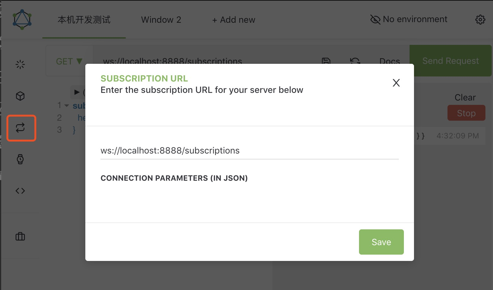
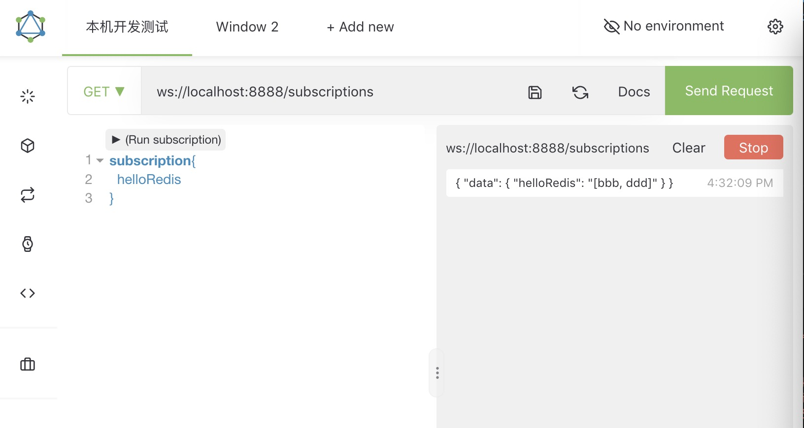

# gapi-gateway

1. [netifi-acmeshoes:Simple store application that composes calls to backend product information services and displays a product page. This example application shows you how to build microservice architectures using Netifi and RSocket.](https://github.com/gregwhitaker/netifi-acmeshoes)
1. [A catalog is a collection of products. A shop operator creates products in the system, and creates one or more variants for each product. ](https://docs.reactioncommerce.com/docs/concepts-catalogs)
1. [Graphql Subscription: try to use the default subscription URL: ws://localhost:8080/subscriptions Make sure that the Flux is pushing events continuously](https://github.com/graphql-java-kickstart/graphql-spring-boot/issues/221)
1. [Schema.org for Variable Products with ProductModels, Offers](https://www.schemaapp.com/newsletter/schema-org-variable-products-productmodels-offers/)
1. [https://www.devglan.com/blog/install-redis-windows-and-mac](https://www.devglan.com/blog/install-redis-windows-and-mac)


# [Shopify GraphQL Design Tutorial: It's based on lessons learned from creating and evolving production schemas at Shopify over almost 3 years. The tutorial has evolved and will continue to change in the future so nothing is set in stone.](https://github.com/Shopify/graphql-design-tutorial)

# graphq subscription testing steps:
1. set subscription url on Altar: ws://localhost:8888/subscriptions

2. add values to redis stream "my-stream"
    ```
    ConandeMacBook-Pro:temp conanchen$ redis-cli
    127.0.0.1:6379> XADD my-stream * aaa bbb ccc ddd
    "1582273929819-0"
    127.0.0.1:6379> 
    ```
3. check helloRedis subscription on Altar
